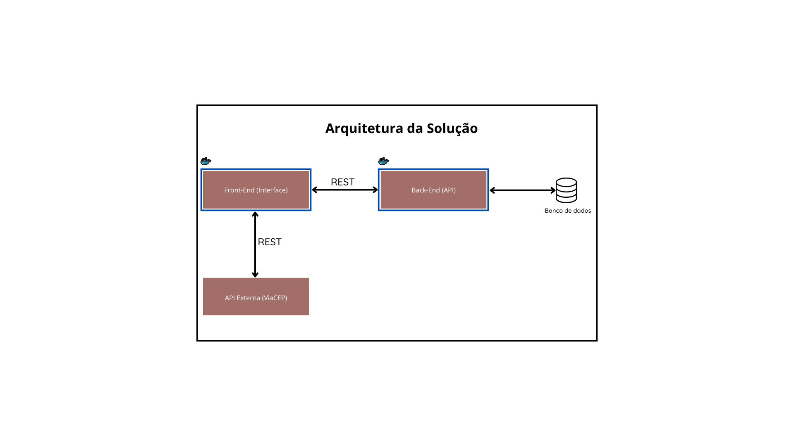

# VestSoft - API Python para Loja de Roupas

Uma API desenvolvida em Python que gerencia o cadastramento de produtos, controle de estoque e registro de vendas de uma loja de roupas. O projeto tem como objetivo oferecer uma solução prática e eficiente para a administração de pequenos comércios.

---

## Funcionalidades

- **Cadastro de Produtos:** Adiciona e gerencia informações de produtos.
- **Controle de Estoque:** Monitora a quantidade de itens disponíveis.
- **Registro de Vendas:** Processa e armazena informações das vendas realizadas.
- **Documentação Integrada:** Acessível via OpenAPI para consulta e testes.

## Diagrama da solução



## Pré-requisitos

- **Python 3.x** instalado.
- **pip** para instalação dos pacotes.
- (Opcional) **virtualenv** para gerenciamento do ambiente virtual.

---

## Instalação

Para configurar o ambiente de desenvolvimento e instalar as dependências do projeto, siga os passos abaixo:

1. **Clone o Repositório:**

   ```bash
   git clone https://github.com/leandromunizdev/mvppucrio-backend.git
   cd nome-do-repositorio

   ```

2. Certifique-se de ter o **Python** instalado.

3. Crie o ambiente virtual:

   ```bash
   python -m venv venv
   ```

4. Ative o ambiente virtual:

   - **No Windows**:
     ```bash
     venv\Scripts\activate
     ```
   - **No Linux/Mac**:
     ```bash
     source venv/bin/activate
     ```

5. Instale as dependências do projeto:
   ```bash
   pip install -r requirements.txt
   ```

---

# Execução

## Executando localmente

1. Execute o comando abaixo para iniciar a aplicação:

   ```bash
   python app.py
   ```

2. A API estará disponível na seguinte URL:

   ```
   http://localhost:<PORTA>
   ```

3. A documentação interativa (OpenAPI/Swagger) da API está disponível na seguinte URL:
   ```
   http://localhost:<PORTA>/openapi
   ```
   Utilize essa interface para testar e explorar os endpoints oferecidos pela aplicação.

## Executando via Docker

### Utilizando o Dockerfile

1. Construa a imagem Docker:

   ```bash
   docker build -t vestsoft-api .
   ```

2. Execute o container:
   ```bash
   docker run -p 5000:5000 vestsoft-api
   ```
3. A API estará disponível na seguinte URL:

   ```
   http://localhost:<PORTA>
   ```

4. A documentação interativa (OpenAPI/Swagger) da API está disponível na seguinte URL:
   ```
   http://localhost:<PORTA>/openapi
   ```
   Utilize essa interface para testar e explorar os endpoints oferecidos pela aplicação.

### Utilizando o docker-compose-yml

1. Construa e inicie os serviços:

   ```bash
   docker-compose up --build
   ```

2. A API estará disponível na seguinte URL:

   ```
   http://localhost:<PORTA>
   ```

3. A documentação interativa (OpenAPI/Swagger) da API está disponível na seguinte URL:
   ```
   http://localhost:<PORTA>/openapi
   ```
   Utilize essa interface para testar e explorar os endpoints oferecidos pela aplicação.

---

# Licença

Este projeto é distribuído sob a licença MIT.
